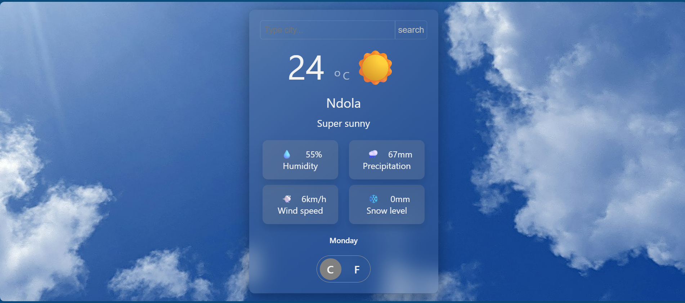

# weather-app

This is a simple and open source weather app. It was built using **HTML**, **Javascript ES Modules**, **Webpack 5** and **CSS** to create a beautiful UI.

## **Table of Contents**
1. [Introduction](#)
2. [Features](#)
3. [Project Structure](#)
4. [Installation](#)
5. [Avaliable Scripts](#)
6. [Demo/Visual](#)
7. [LIcense](#)
8. [Author](#)

## 1. **Introduction**

The todo-list app is entirely built using **HTML** for the **UI** components, **CSS** for the styles and **Javascript** for the DOM manipulation and fetching of data using the **Fetch API**.

This project is ideal for learning: - Webpack setup - ES module
architecture -Working with API to fetch data from servers

## 2. **Features**

### ✔ Modular ES6 javascript

Different modules have been separated to keep the code clean and readable.

###  ✔ Fetching data from servers

Uses the **Fetch API** (you can read more about it on [mdn](https://developer.mozilla.org/en-US/docs/Web/API/Fetch_API)) to get data from the server and display it no the screen

## 3. **Project Structure**

```text
weather-app/
├── src/
│   ├── css/
│   │   └──styles.css
│   ├── html/
│   │   └──template.html
│   └── javascript/
│       ├──fetchData.js
│       └──index.js
├── package-lock.json
├── package.json
├── README.md
└── webpack.config.js
```

## 4. **Installation**

### Clone the repository

```bash
git clone https://github.com/unggie/todo-list.git
cd todo-list
```

### Install the dependencies

```bash
npm install
```

## 5. **Avaliable Scripts**

### Start servers
```bash
npm run dev
```

- Opens a local server 
- Auto rebuilds upon saving

## 6. **Demo/Visual**

[Live demo](https://unggie.github.io/weather-app/)



## 7. **License**

This project is licensed under the **ISC License**.

## 8. **Author**

**Phiri Ungweru**\
phiriungweru@gmail.com\
GitHub: https://github.com/unggie